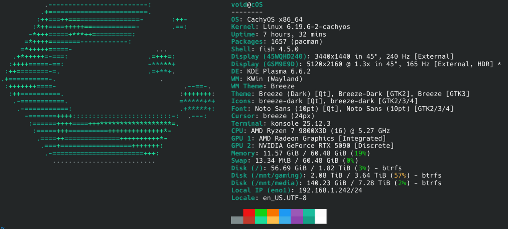

# CachyOS Gaming Setup

Declarative configs and guides for a full gaming desktop on CachyOS/Arch Linux. Born from a
complete Windows-to-Linux migration finished in about three days. Everything here is a real
daily-driver setup — not a proof of concept.

The repo covers nine subsystems: encrypted storage, Steam with Proton, Battle.net via Lutris,
DCS World (standalone + VR), audio routing with the RODECaster Duo and PipeWire, a ProtonVPN
WireGuard namespace, TrackIR 5 head tracking, and wireless VR streaming via WiVRn to a Meta
Quest 3.

If you came here from Windows wondering whether Linux is actually viable for serious gaming and
flight simulation — it is. The main friction is the first few days, not the ongoing experience.

---

## What's Included

| Subsystem | Status | Guide | Script |
|-----------|--------|-------|--------|
| Storage (LUKS + btrfs auto-unlock) | Working | docs/01-storage.md | — |
| Steam / Proton Gaming | Working | docs/02-gaming.md | scripts/02-gaming-setup.sh |
| Battle.net (Lutris) — all 5 titles | Working | docs/03-battlenet.md | — |
| DCS World Standalone | Working | docs/04-dcs-world.md | scripts/04-dcs-setup.sh |
| DCS World VR | Working | docs/04-dcs-world.md | scripts/04-dcs-launch-vr.sh |
| Audio (RODECaster Duo + PipeWire) | Working | docs/05-audio.md | scripts/05-audio-setup.sh |
| VPN Namespace (ProtonVPN + WireGuard) | Working | docs/06-vpn.md | scripts/06-vpn-setup.sh |
| TrackIR 5 (LinuxTrack Wine bridge) | Working | docs/04-dcs-world.md | scripts/04-dcs-setup.sh |
| VR (WiVRn + Quest 3 wireless) | Working | docs/07-vr.md | scripts/07-vr-setup.sh |

Battle.net covers: World of Warcraft, WoW Classic, Diablo IV, Diablo II: Resurrected, StarCraft II.

VR is wireless streaming over Wi-Fi 6. SteamVR is not involved. The stack is
DCS → xrizer (OpenVR→OpenXR bridge) → WiVRn → Quest 3 with AV1 hardware decode.

---

## Hardware

This repo was built and tested on the following hardware. Some configs (shader cache sizes,
NVIDIA encoder choices, CPU tuning notes) are specific to this setup but the patterns transfer.

| Component | Model |
|-----------|-------|
| CPU | AMD Ryzen 9 9800X3D (Zen 5, single CCD) |
| GPU | NVIDIA RTX 5090 |
| RAM | 64 GB |
| Audio Interface | RODECaster Duo (USB) |
| HOTAS | VKB STECS Throttle + Gladiator IV EVO + T-Rudder Pedals |
| Head Tracker | TrackIR 5 (sensor replaced with [RJSIMTECH BT clip](https://www.etsy.com/shop/RJSIMTECH)) |
| Monitors | LG 5K2K + Corsair Xeneon Flex 45" |
| VR Headset | Meta Quest 3 |
| Streaming | Elgato Stream Deck |
| Webcam | Logitech C920 |

---

## Repo Structure

```
.
├── docs/            # Numbered guides in dependency order
├── scripts/         # Idempotent setup scripts (safe to re-run)
│   └── lib/         # Shared bash libraries (common.sh, dcs-env.sh)
└── configs/         # Config templates (.example files with CHANGEME_* placeholders)
    ├── audio/       # PipeWire / RODECaster configs
    ├── gaming/      # Steam / Proton configs
    ├── vpn/         # WireGuard namespace configs
    └── vr/          # DCS VR options.lua example
```

Docs and scripts use matched numbering: `docs/02-gaming.md` pairs with
`scripts/02-gaming-setup.sh`, `docs/05-audio.md` pairs with `scripts/05-audio-setup.sh`, and so
on. Follow the guides in numeric order — later ones depend on earlier ones being complete.

The `configs/` directory contains only `.example` files. Real configs (with your actual keys,
UUIDs, and usernames) are gitignored. Copy the example, fill in your values, and the script will
deploy it to the right place.

---

## Getting Started

**Clone the repo:**

```bash
git clone https://github.com/defconxt/Arch-CachyOS.git
cd Arch-CachyOS
```

**Find everything you need to fill in:**

```bash
grep -r 'CHANGEME_' .
```

Every `CHANGEME_*` token is a value that is specific to your system — a LUKS UUID, a username,
a WireGuard private key, a device serial number. The grep output shows you exactly which files
and which lines need attention before you run anything.

**Follow the guides in order:**

Work through `docs/01-storage.md` through `docs/07-vr.md` sequentially. Each guide tells you
which script to run (if any) and what manual steps are needed. Storage and Battle.net are
manual-only; everything else has a paired setup script.

**Scripts are idempotent:**

Every script in `scripts/` is safe to re-run. If a step is already done, the script detects it
and skips with a message. Re-running after a system update or reprovisioning is expected and
supported.

---

## Guide Index

1. **[docs/01-storage.md](docs/01-storage.md)** — LUKS-encrypted secondary drive auto-unlock at
   boot using a keyfile stored in the initramfs. Covers crypttab, fstab, mkinitcpio, and UUID
   identification for both btrfs and LUKS layers.

2. **[docs/02-gaming.md](docs/02-gaming.md)** — Steam, Proton runners (GE-Proton, proton-cachyos-slr),
   gaming drive library setup, NVIDIA shader cache tuning, gamemode, and launch option reference.

3. **[docs/03-battlenet.md](docs/03-battlenet.md)** — Battle.net via Lutris with the
   proton-cachyos-slr runner. Covers the Wine prefix, W: drive mapping to the gaming drive, and
   verified install paths for all five Blizzard titles.

4. **[docs/04-dcs-world.md](docs/04-dcs-world.md)** — DCS World Standalone via umu-run and
   GE-Proton. Covers the Wine prefix, winetricks dependencies, Saved Games symlink, VKB HOTAS
   udev rules, TrackIR 5 via LinuxTrack, F-18C keybind GUID migration from Windows, and the full
   WiVRn VR launch flow with OpenXR environment variables.

5. **[docs/05-audio.md](docs/05-audio.md)** — RODECaster Duo with PipeWire in Pro Audio mode.
   Virtual sink routing (System and Chat channels), per-app routing for Discord and OBS, Firefox
   PipeWire config, and a Plex Media Server systemd override for late-mounted drives.

6. **[docs/06-vpn.md](docs/06-vpn.md)** — ProtonVPN WireGuard network namespace. Brave and
   qBittorrent route all traffic through the VPN namespace; everything else (Steam, games,
   Discord) uses the normal connection. Covers setup, systemd services, NAT-PMP port forwarding,
   and Brave managed policies.

7. **[docs/07-vr.md](docs/07-vr.md)** — WiVRn wireless VR streaming to Meta Quest 3. Covers
   install, avahi/mDNS setup, OpenXR runtime configuration, WiVRn dashboard settings (AV1, nvenc,
   200 Mbps), Quest 3 pairing, and firewall rules scoped to the LAN interface.

---

## Credits and References

This setup builds on the work of the following projects:

- [LinuxTrackX-IR](https://gitlab.com/fwfa123/linuxtrackx-ir) — TrackIR support on Linux via a
  Wine bridge that intercepts NPClient DLL calls (successor to
  [LinuxTrack](https://github.com/uglyDwarf/linuxtrack))
- [LVRA (Linux VR Adventures)](https://lvra.gitlab.io/) — Linux VR community wiki covering
  OpenXR, WiVRn, Monado, and headset compatibility
- [WiVRn](https://github.com/WiVRn/WiVRn) — OpenXR streaming runtime for standalone VR headsets
  with Quest 3 support and AV1 hardware encode/decode
- [xrizer](https://github.com/Supreeeme/xrizer) — OpenVR-to-OpenXR bridge that lets legacy
  SteamVR games (like DCS World) run on any OpenXR runtime
- [Hoggit DCS Wiki](https://wiki.hoggitworld.com/) — DCS World community reference for scripting,
  keybinds, and module documentation
- [ChaosRifle/DCS-on-Linux](https://github.com/ChaosRifle/DCS-on-Linux) — DCS World Linux setup
  guide covering Proton versions, Wine prefixes, and workarounds
- [rodecaster-duo-pipewire](https://github.com/rewalo/rodecaster-duo-pipewire) — RODECaster
  Duo PipeWire configuration for virtual sinks and audio routing
- [rusty-path-of-building](https://github.com/meehl/rusty-path-of-building) — Path of
  Building for Linux packaged for AUR (covers PoE1 and PoE2)

---

## License

MIT — see [LICENSE](LICENSE).
